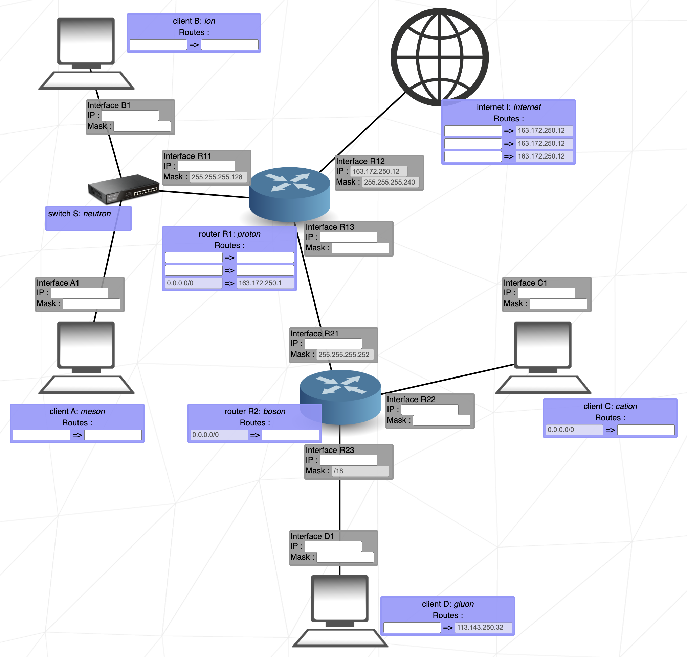

> # 🌐 net_practice

네트워크 기초를 학습하고 10개의 문제를 풀어서 제출하는 실습 과제

## 문제 예시

 

## ✏️ Review

- 주어진 네트워크 환경에서 IP 주소 설정, 서브넷팅, 라우팅을 통해 문제를 해결하며 IPv4 주소 체계, 서브넷 마스크, 라우팅 테이블에 대한 이해를 높일 수 있었습니다.
- 네트워크 기초 개념을 학습할 수 있었습니다.
